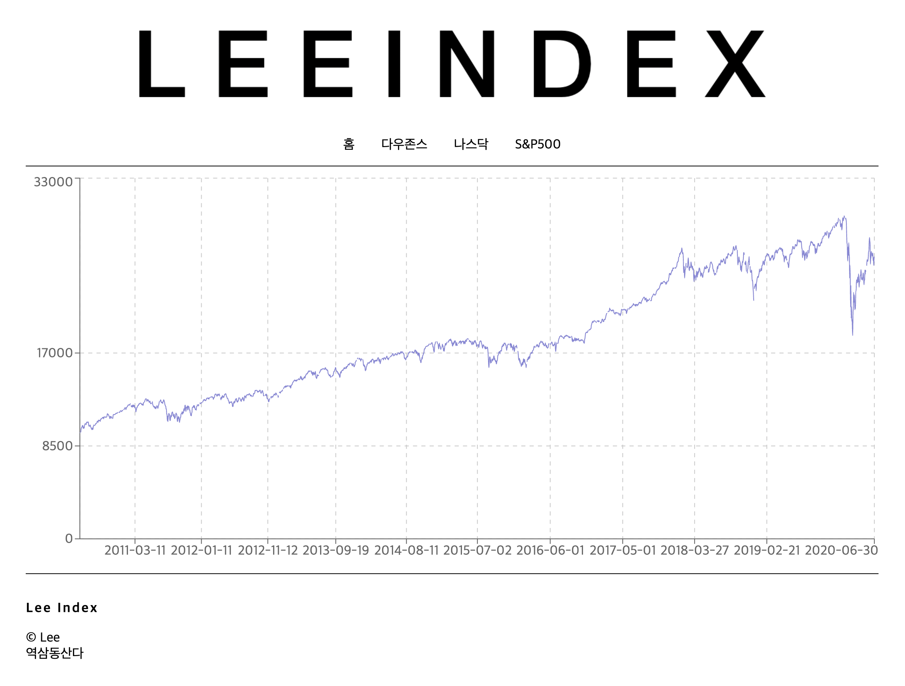

# MINI PROJECT 1 - Economy Index

이번 시간은 외부라이브러리, API 사용법, SPA Routing, styled-components에 대해 배우는 시간입니다. 이 프로젝트를 통해 SPA에서 어떻게 페이지를 이동하는지, 그리고 라이프 사이클 사용법, 외부 API 사용법을 익힐 수 있습니다. Fred에서 제공하는 API를 가지고 데이터를 전송받아, 그래프를 보여주는 페이지를 완성해주세요.

## Requirements

---

아래의 라이브러리를 모두 사용해주세요.

- React: 리액트 패키지입니다(Create-React-App을 사용하세요).
- React Router Dom: 라우팅(페이지 이동)을 도와주는 패키지입니다.
- Recharts: 자바스크립트 시각화 패키지입니다.
- Axios: Promise기반 HTTP통신 라이브러리로, API 데이터를 받아오는 것을 돕습니다
- Styeld-Components: 리액트용 디자인 패키지입니다.

## Fred API

---

[Fred](https://fred.stlouisfed.org/)(세인트루이스 연준)에서 제공하는 경제 데이터 사이트입니다. 사이트에 접속해서 API 사용법을 찾아보세요. Fred API는 Fred에서 지정한 '코드네임'을 통해 데이터를 받아올 수 있습니다. 다우존스지수(DJIA), 나스닥(NASDAQCOM), S&P500(SP500) 데이터를 받아서 과제를 완성해주세요.

[Fred API](https://fred.stlouisfed.org/docs/api/fred/) 사이트에 들어가면 API 사용법에 대한 설명을 볼 수 있습니다.
